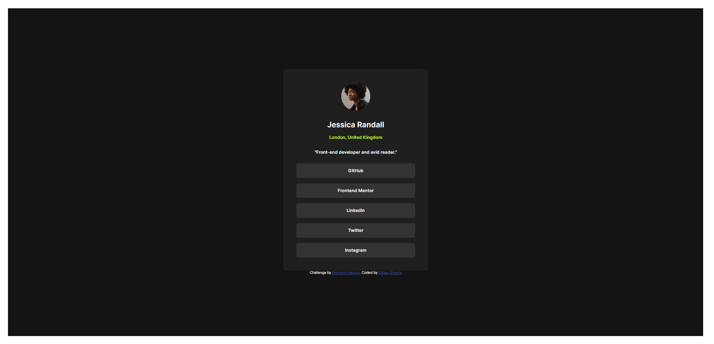
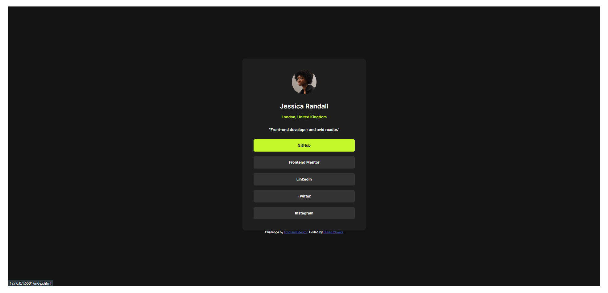

# Frontend Mentor - Social links profile solution

This is a solution to the [Social links profile challenge on Frontend Mentor](https://www.frontendmentor.io/challenges/social-links-profile-UG32l9m6dQ). Frontend Mentor challenges help you improve your coding skills by building realistic projects.

## Table of contents


- [Frontend Mentor - Social links profile solution](#frontend-mentor---social-links-profile-solution)
  - [Table of contents](#table-of-contents)
  - [Overview](#overview)
    - [The challenge](#the-challenge)
    - [Screenshot](#screenshot)
    - [Links](#links)
  - [My process](#my-process)
    - [Built with](#built-with)
    - [What I learned](#what-i-learned)
    - [Continued development](#continued-development)
  - [Author](#author)
  - [Acknowledgments](#acknowledgments)


## Overview

### The challenge

Users should be able to:

- See hover and focus states for all interactive elements on the page

### Screenshot

Expected solution:


My solution:




### Links

- Solution URL: [Social Links Profile Repo](https://github.com/lia-oliveira/social-links-profile)
- Live Site URL: [Social Links Profile Live](https://social-links-profile-one-lac.vercel.app/)

## My process

### Built with

- Semantic HTML5 markup
- CSS custom properties
- Flexbox
- Mobile-first workflow

### What I learned
1. To make a square image round, since the image was already in a square format of 32 x 32, it was enough to apply a border-radius of 50%, as shown below.

```css
.card header img {
    ...
    border-radius: 50%;
}
```

2. To make the link clickable anywhere in the container, I applied a display: block to the link itself and used a line-height equal to that of the parent element.
```css
main ul li a{
    display: block;
    text-align: center;
    line-height: 2.75rem;
    width: 100%;
}
```
3.The separation between the links was achieved using the Flexbox gap property.

```css
main ul{
    display: flex;
    flex-direction: column;
    gap:0.9375rem;
}
```
### Continued development
I intend to continue exploring the various applications of Flexbox.

## Author

- Website - [Github @lia-oliveira](https://github.com/lia-oliveira)
- Frontend Mentor - [@lia-oliveira](https://www.frontendmentor.io/profile/lia-oliveira)

## Acknowledgments
I’m grateful for the valuable tips from users @SabineEmden and @Mohammed Aljbalai regarding accessibility. I’ve already started using the tools they suggested, and they’ve been incredibly helpful.

